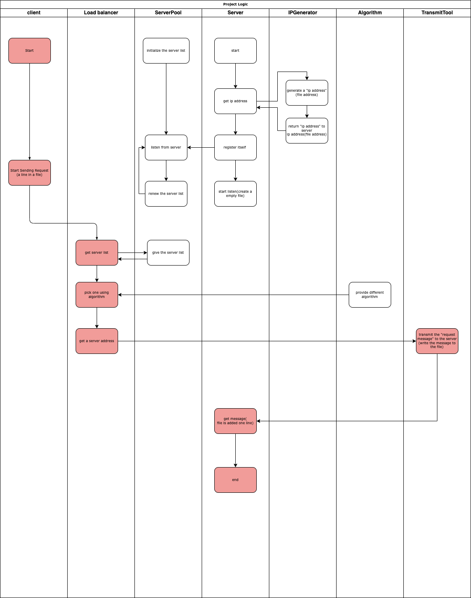

# CS6422-LoadBalancer
A load balancer for CS6422
This load balancer can dirstribute client requests to different server.
To simulate the environment. 
- We use a text file as input, where each line represent a request from one customer, like: Tom,Marry,Jack..,etc. By default we suppose the website is all the same,like www.google.com.
- We would create a blank file act as a server who starts listening the request from client. The "IP address" is actually the specific directory location of this blank file.
- Once the request get distributed by load balancer, the request line (that is Tom) would be wrote into the server file (that act as a server).

# Design
## logic work flow 
I draw the basic logic work flow. The rectangular in red is the main process. Each lane is the class name. If we want to use their method, use class.method() to get result. The specific classes and each's methods,attributes need to be furthur considered.

